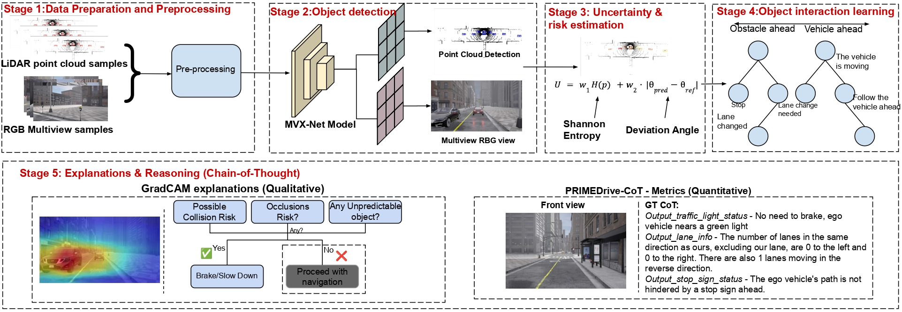

  

  <h1>PRIMEDrive-CoT: A Precognitive Chain-of-Thought Framework for Uncertainty-Aware Object Interaction in Driving Scene Scenario</h1> 

 

  

  <a href='https://srirammandalika.github.io/' target='_blank'>Sriram Mandalika</a>1&emsp;
  <a href='https://www.linkedin.com/in/lalithav14/' target='_blank'>Lalitha V</a>1&emsp;  
  <a href='https://www.srmist.edu.in/faculty/dr-athira-m-nambiar/' target='_blank'>Athira Nambiar</a>1&emsp;

  
1SRM Institute of Science and Technology, Kattankulathur, India - 603203&emsp;

<!--     <a href='' target='_blank'>Enzo Tartaglione</a>1&emsp;
    <a href='' target='_blank'>Stéphane Lathuilière </a>1 -->

<!-- 2University of Trento, Italy&emsp; -->

 

The code repository for "[PRIMEDrive-CoT: A Precognitive Chain-of-Thought Framework for Uncertainty-Aware Object Interaction in Driving Scene Scenario]()" in PyTorch.

## Abstract:
Driving scene understanding is a critical real-world problem that involves interpreting and associating various elements of a driving environment, such as vehicles, pedestrians, and traffic signals. Despite advancements in autonomous driving, traditional pipelines rely on deterministic models that fail to capture the probabilistic nature and inherent uncertainty of real-world driving. To address this, we propose PRIMEDrive-CoT, a novel uncertainty-aware model for object interaction and Chain-of-Thought (CoT) reasoning in driving scenarios. In particular, our approach combines LiDAR-based 3D object detection with multi-view RGB references to ensure interpretable and reliable scene understanding. Uncertainty and risk assessment, along with object interactions, are modelled using Bayesian Graph Neural Networks (BGNNs) for probabilistic reasoning under ambiguous conditions. Interpretable decisions are facilitated through CoT reasoning, leveraging object dynamics and contextual cues, while Grad-CAM visualizations highlight attention regions. Extensive evaluations on the DriveCoT dataset demonstrate that PRIMEDrive-CoT outperforms state-of-the-art CoT and risk-aware models.

## Our Proposed Framework:

# Dataset: 
- We use DriveCoT datasets for Chain-of-Thought reasoning and LiDAR-based object detection.

The dataset can be found here: https://drivecot.github.io/download.html

## Software requirements:

# Software requirements:
- Numpy, scipy, pytorch, sklearn, matplotlib, pandas

- To download the dependencies: **!pip install -r requirements.txt**

- The code can be run on any PC.
